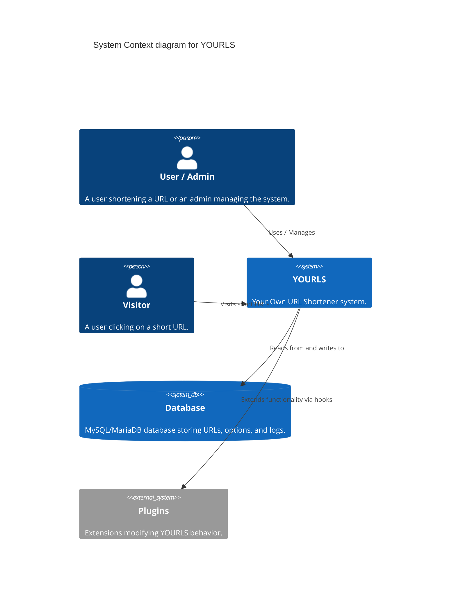
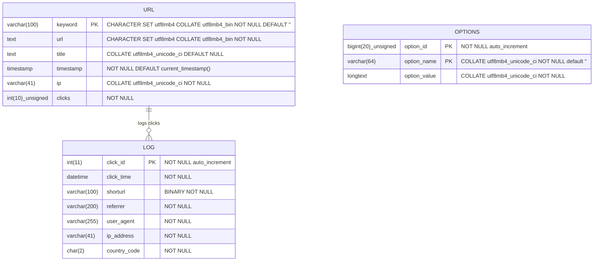
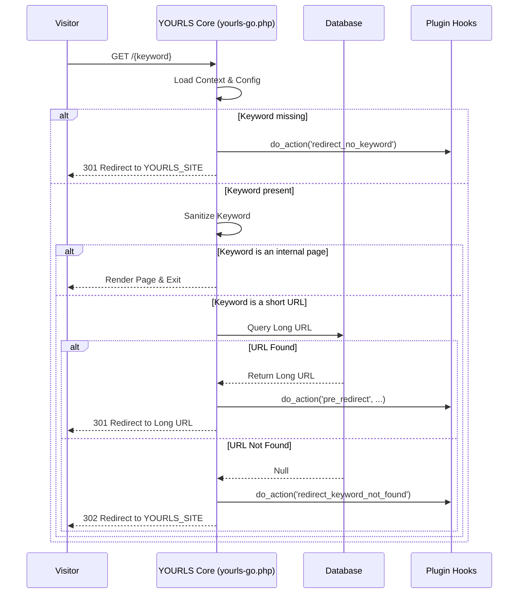
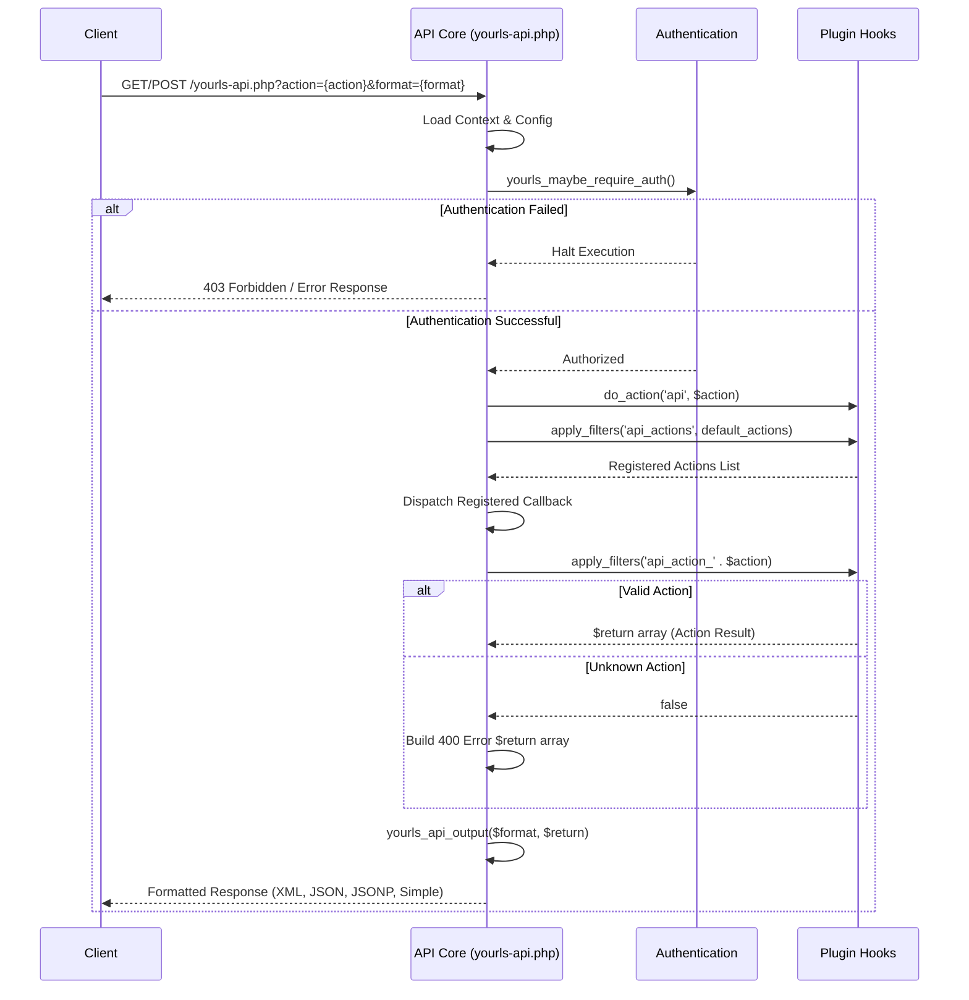

# YOURLS Architecture Map

This document visualizes the hidden boundaries, data flows, and architectural boundaries of the YOURLS project using Mermaid.js diagrams.

## System Context (C4 Model)

## Relational Schema Topography (ER Diagram)

## Short URL Redirection Pipeline (yourls-go.php)

## API Request Pipeline (yourls-api.php)

