# YOURLS Architecture Map

This document visualizes the hidden boundaries, data flows, and architectural boundaries of the YOURLS project using Mermaid.js diagrams.

## System Context (C4 Model)

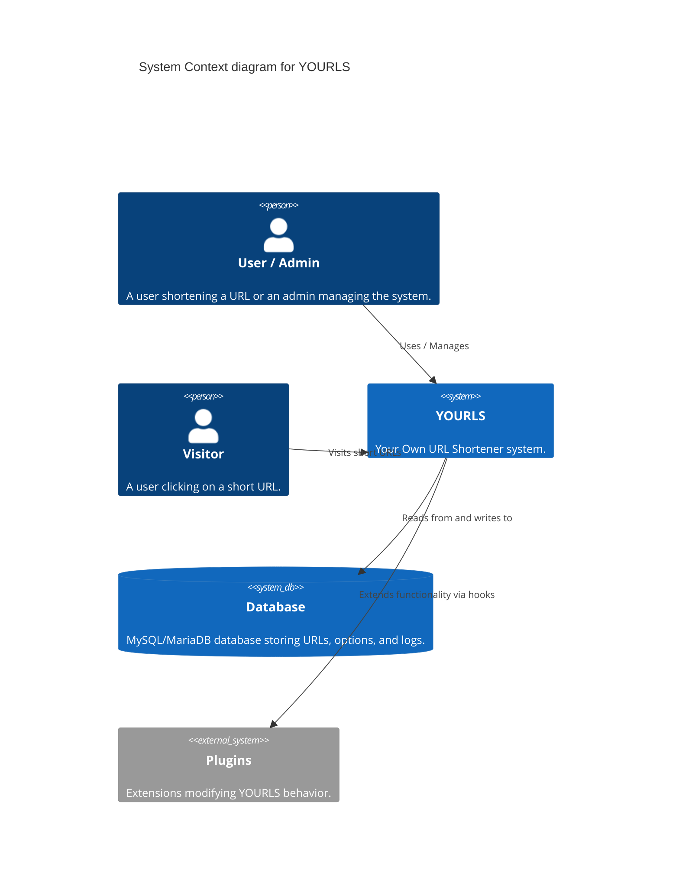
```mermaid
C4Context
  title System Context diagram for YOURLS
  Person(user, "User / Admin", "A user shortening a URL or an admin managing the system.")
  Person(visitor, "Visitor", "A user clicking on a short URL.")
  System(yourls, "YOURLS", "Your Own URL Shortener system.")
  SystemDb(db, "Database", "MySQL/MariaDB database storing URLs, options, and logs.")
  System_Ext(plugins, "Plugins", "Extensions modifying YOURLS behavior.")

  Rel(user, yourls, "Uses / Manages")
  Rel(visitor, yourls, "Visits short URLs")
  Rel(yourls, db, "Reads from and writes to")
  Rel(yourls, plugins, "Extends functionality via hooks")
```

## Relational Schema Topography (ER Diagram)

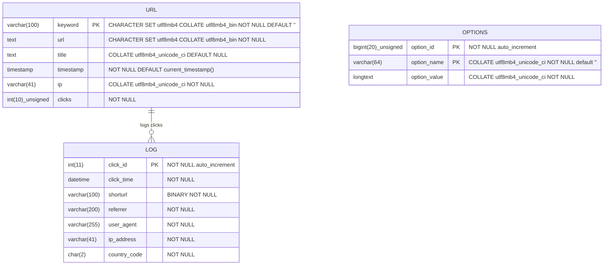
```mermaid
erDiagram
    URL {
        varchar(100) keyword PK "CHARACTER SET utf8mb4 COLLATE utf8mb4_bin NOT NULL DEFAULT ''"
        text url "CHARACTER SET utf8mb4 COLLATE utf8mb4_bin NOT NULL"
        text title "COLLATE utf8mb4_unicode_ci DEFAULT NULL"
        timestamp timestamp "NOT NULL DEFAULT current_timestamp()"
        varchar(41) ip "COLLATE utf8mb4_unicode_ci NOT NULL"
        int(10)_unsigned clicks "NOT NULL"
    }

    OPTIONS {
        bigint(20)_unsigned option_id PK "NOT NULL auto_increment"
        varchar(64) option_name PK "COLLATE utf8mb4_unicode_ci NOT NULL default ''"
        longtext option_value "COLLATE utf8mb4_unicode_ci NOT NULL"
    }

    LOG {
        int(11) click_id PK "NOT NULL auto_increment"
        datetime click_time "NOT NULL"
        varchar(100) shorturl "BINARY NOT NULL"
        varchar(200) referrer "NOT NULL"
        varchar(255) user_agent "NOT NULL"
        varchar(41) ip_address "NOT NULL"
        char(2) country_code "NOT NULL"
    }

    URL ||--o{ LOG : "logs clicks"
```

## Short URL Redirection Pipeline (yourls-go.php)

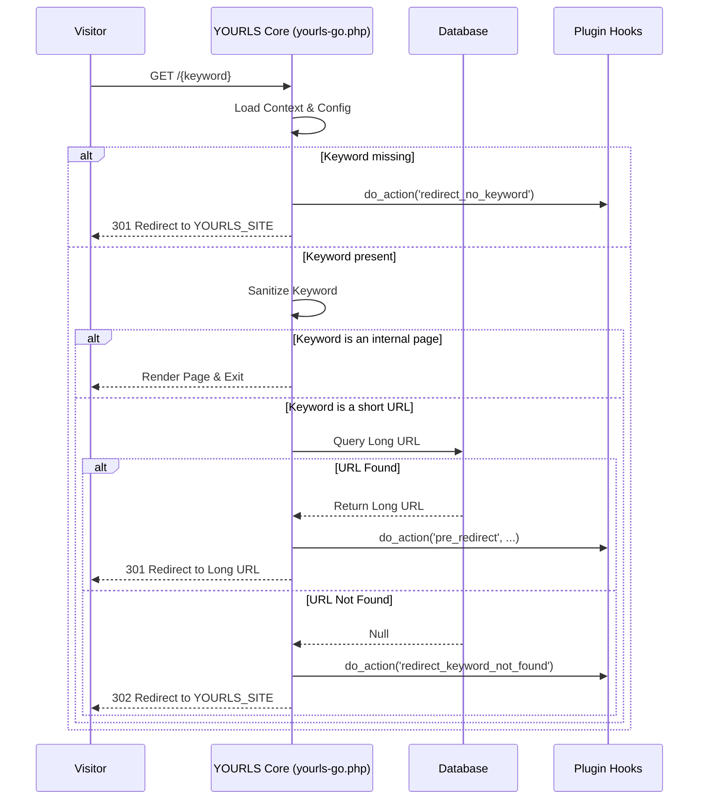
```mermaid
sequenceDiagram
    participant Visitor
    participant Core as YOURLS Core (yourls-go.php)
    participant DB as Database
    participant Hooks as Plugin Hooks

    Visitor->>Core: GET /{keyword}
    Core->>Core: Load Context & Config
    alt Keyword missing
        Core->>Hooks: do_action('redirect_no_keyword')
        Core-->>Visitor: 301 Redirect to YOURLS_SITE
    else Keyword present
        Core->>Core: Sanitize Keyword
        alt Keyword is an internal page
            Core-->>Visitor: Render Page & Exit
        else Keyword is a short URL
            Core->>DB: Query Long URL
            alt URL Found
                DB-->>Core: Return Long URL
                Core->>Hooks: do_action('pre_redirect', ...)
                Core-->>Visitor: 301 Redirect to Long URL
            else URL Not Found
                DB-->>Core: Null
                Core->>Hooks: do_action('redirect_keyword_not_found')
                Core-->>Visitor: 302 Redirect to YOURLS_SITE
            end
        end
    end
```

## API Request Pipeline (yourls-api.php)

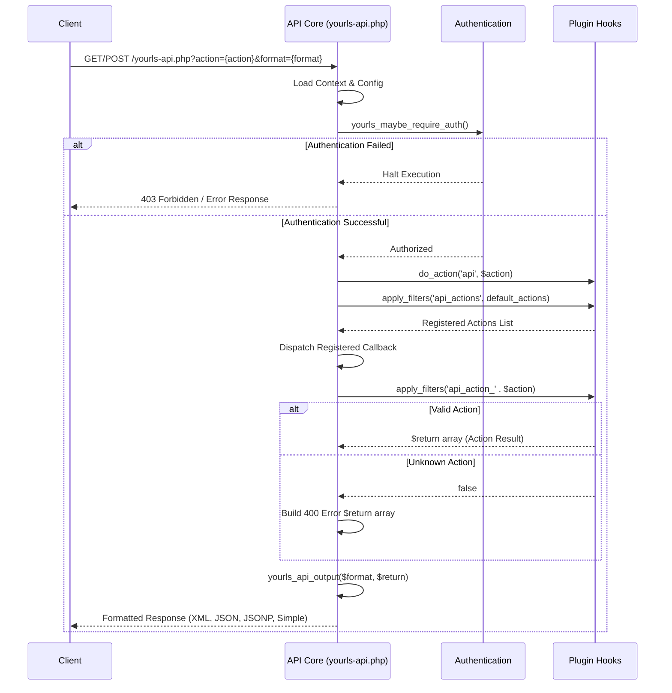
```mermaid
sequenceDiagram
    participant Client
    participant API as API Core (yourls-api.php)
    participant Auth as Authentication
    participant Hooks as Plugin Hooks

    Client->>API: GET/POST /yourls-api.php?action={action}&format={format}
    API->>API: Load Context & Config
    API->>Auth: yourls_maybe_require_auth()
    alt Authentication Failed
        Auth-->>API: Halt Execution
        API-->>Client: 403 Forbidden / Error Response
    else Authentication Successful
        Auth-->>API: Authorized
        API->>Hooks: do_action('api', $action)
        API->>Hooks: apply_filters('api_actions', default_actions)
        Hooks-->>API: Registered Actions List
        API->>API: Dispatch Registered Callback
        API->>Hooks: apply_filters('api_action_' . $action)
        alt Valid Action
            Hooks-->>API: $return array (Action Result)
        else Unknown Action
            Hooks-->>API: false
            API->>API: Build 400 Error $return array
        end
        API->>API: yourls_api_output($format, $return)
        API-->>Client: Formatted Response (XML, JSON, JSONP, Simple)
    end
```

## Auth Pipeline Sequencing (includes/auth.php & functions-auth.php)

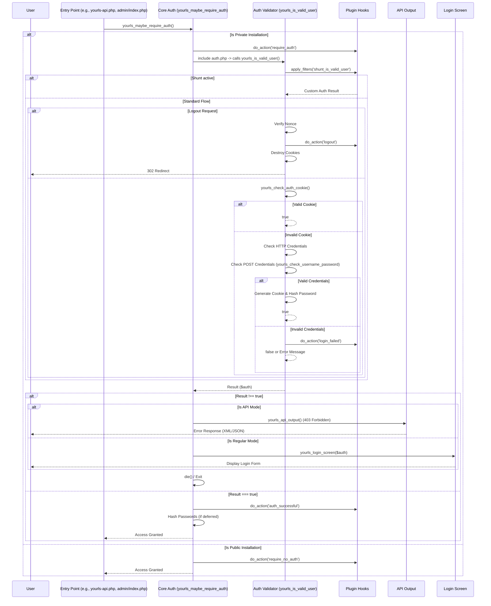
```mermaid
sequenceDiagram
    participant User
    participant Router as Entry Point (e.g., yourls-api.php, admin/index.php)
    participant Core as Core Auth (yourls_maybe_require_auth)
    participant Auth as Auth Validator (yourls_is_valid_user)
    participant Hooks as Plugin Hooks
    participant API as API Output
    participant UI as Login Screen

    Router->>Core: yourls_maybe_require_auth()
    alt Is Private Installation
        Core->>Hooks: do_action('require_auth')
        Core->>Auth: include auth.php -> calls yourls_is_valid_user()
        Auth->>Hooks: apply_filters('shunt_is_valid_user')

        alt Shunt active
            Hooks-->>Auth: Custom Auth Result
        else Standard Flow
            alt Logout Request
                Auth->>Auth: Verify Nonce
                Auth->>Hooks: do_action('logout')
                Auth->>Auth: Destroy Cookies
                Auth-->>User: 302 Redirect
            else
                Auth->>Auth: yourls_check_auth_cookie()
                alt Valid Cookie
                    Auth-->>Auth: true
                else Invalid Cookie
                    Auth->>Auth: Check HTTP Credentials
                    Auth->>Auth: Check POST Credentials (yourls_check_username_password)
                    alt Valid Credentials
                        Auth->>Auth: Generate Cookie & Hash Password
                        Auth-->>Auth: true
                    else Invalid Credentials
                        Auth->>Hooks: do_action('login_failed')
                        Auth-->>Auth: false or Error Message
                    end
                end
            end
        end

        Auth-->>Core: Result ($auth)

        alt Result !== true
            alt Is API Mode
                Core->>API: yourls_api_output() (403 Forbidden)
                API-->>User: Error Response (XML/JSON)
            else Is Regular Mode
                Core->>UI: yourls_login_screen($auth)
                UI-->>User: Display Login Form
            end
            Core->>Core: die() / Exit
        else Result === true
            Core->>Hooks: do_action('auth_successful')
            Core->>Core: Hash Passwords (if deferred)
            Core-->>Router: Access Granted
        end
    else Is Public Installation
        Core->>Hooks: do_action('require_no_auth')
        Core-->>Router: Access Granted
    end
```

## Core Initialization & Plugin Hook Architecture

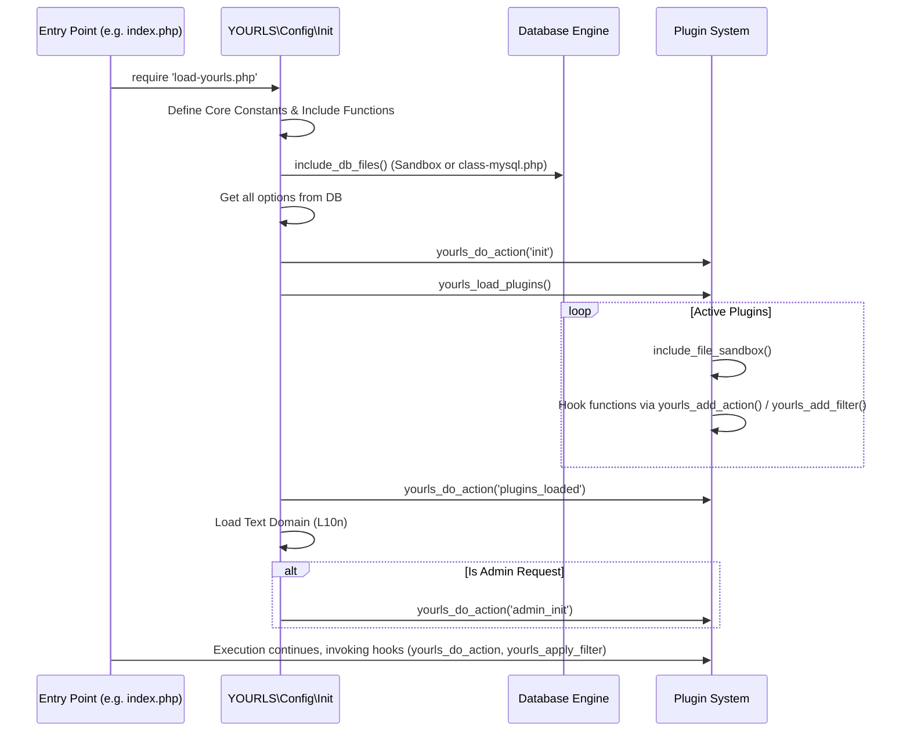
```mermaid
sequenceDiagram
    participant Index as Entry Point (e.g. index.php)
    participant Config as YOURLS\Config\Init
    participant DB as Database Engine
    participant Plugins as Plugin System

    Index->>Config: require 'load-yourls.php'
    Config->>Config: Define Core Constants & Include Functions
    Config->>DB: include_db_files() (Sandbox or class-mysql.php)
    Config->>Config: Get all options from DB
    Config->>Plugins: yourls_do_action('init')
    Config->>Plugins: yourls_load_plugins()
    loop Active Plugins
        Plugins->>Plugins: include_file_sandbox()
        Plugins->>Plugins: Hook functions via yourls_add_action() / yourls_add_filter()
    end
    Config->>Plugins: yourls_do_action('plugins_loaded')
    Config->>Config: Load Text Domain (L10n)
    alt Is Admin Request
        Config->>Plugins: yourls_do_action('admin_init')
    end
    Index->>Plugins: Execution continues, invoking hooks (yourls_do_action, yourls_apply_filter)
```

## Authentication Lifecycle (functions-auth.php)

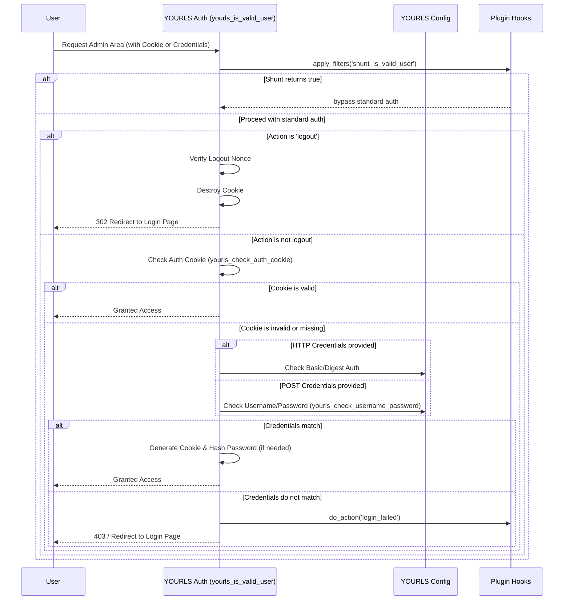
```mermaid
sequenceDiagram
    participant User
    participant Auth as YOURLS Auth (yourls_is_valid_user)
    participant Config as YOURLS Config
    participant Hooks as Plugin Hooks

    User->>Auth: Request Admin Area (with Cookie or Credentials)
    Auth->>Hooks: apply_filters('shunt_is_valid_user')
    alt Shunt returns true
        Hooks-->>Auth: bypass standard auth
    else Proceed with standard auth
        alt Action is 'logout'
            Auth->>Auth: Verify Logout Nonce
            Auth->>Auth: Destroy Cookie
            Auth-->>User: 302 Redirect to Login Page
        else Action is not logout
            Auth->>Auth: Check Auth Cookie (yourls_check_auth_cookie)
            alt Cookie is valid
                Auth-->>User: Granted Access
            else Cookie is invalid or missing
                alt HTTP Credentials provided
                    Auth->>Config: Check Basic/Digest Auth
                else POST Credentials provided
                    Auth->>Config: Check Username/Password (yourls_check_username_password)
                end

                alt Credentials match
                    Auth->>Auth: Generate Cookie & Hash Password (if needed)
                    Auth-->>User: Granted Access
                else Credentials do not match
                    Auth->>Hooks: do_action('login_failed')
                    Auth-->>User: 403 / Redirect to Login Page
                end
            end
        end
    end
```

## Loader Routing State Machine (yourls-loader.php)

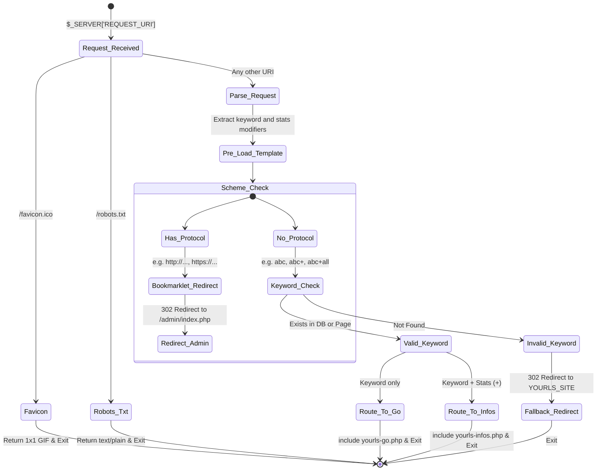
```mermaid
stateDiagram-v2
    [*] --> Request_Received: $_SERVER['REQUEST_URI']

    Request_Received --> Favicon: /favicon.ico
    Favicon --> [*]: Return 1x1 GIF & Exit

    Request_Received --> Robots_Txt: /robots.txt
    Robots_Txt --> [*]: Return text/plain & Exit

    Request_Received --> Parse_Request: Any other URI
    Parse_Request --> Pre_Load_Template: Extract keyword and stats modifiers
    Pre_Load_Template --> Scheme_Check

    state Scheme_Check {
        [*] --> Has_Protocol
        Has_Protocol --> Bookmarklet_Redirect: e.g. http://..., https://...
        Bookmarklet_Redirect --> Redirect_Admin: 302 Redirect to /admin/index.php

        [*] --> No_Protocol
        No_Protocol --> Keyword_Check: e.g. abc, abc+, abc+all
    }

    Keyword_Check --> Valid_Keyword: Exists in DB or Page
    Valid_Keyword --> Route_To_Go: Keyword only
    Route_To_Go --> [*]: include yourls-go.php & Exit

    Valid_Keyword --> Route_To_Infos: Keyword + Stats (+)
    Route_To_Infos --> [*]: include yourls-infos.php & Exit

    Keyword_Check --> Invalid_Keyword: Not Found
    Invalid_Keyword --> Fallback_Redirect: 302 Redirect to YOURLS_SITE
    Fallback_Redirect --> [*]: Exit
```
## URL Shortening Core Flow (yourls_add_new_link)

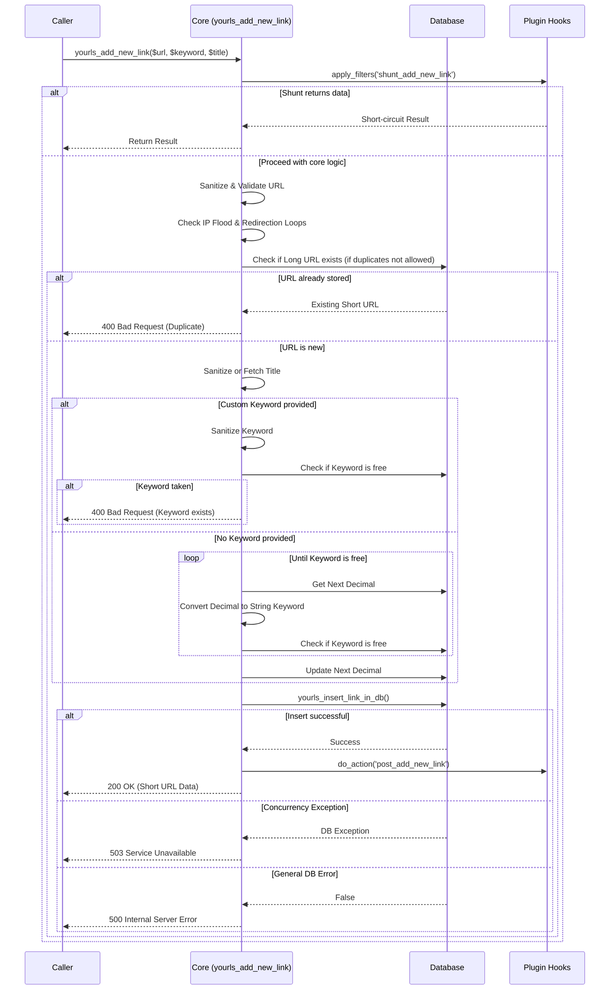
```mermaid
sequenceDiagram
    participant Caller
    participant Core as Core (yourls_add_new_link)
    participant DB as Database
    participant Hooks as Plugin Hooks

    Caller->>Core: yourls_add_new_link($url, $keyword, $title)
    Core->>Hooks: apply_filters('shunt_add_new_link')
    alt Shunt returns data
        Hooks-->>Core: Short-circuit Result
        Core-->>Caller: Return Result
    else Proceed with core logic
        Core->>Core: Sanitize & Validate URL
        Core->>Core: Check IP Flood & Redirection Loops
        Core->>DB: Check if Long URL exists (if duplicates not allowed)
        alt URL already stored
            DB-->>Core: Existing Short URL
            Core-->>Caller: 400 Bad Request (Duplicate)
        else URL is new
            Core->>Core: Sanitize or Fetch Title
            alt Custom Keyword provided
                Core->>Core: Sanitize Keyword
                Core->>DB: Check if Keyword is free
                alt Keyword taken
                    Core-->>Caller: 400 Bad Request (Keyword exists)
                end
            else No Keyword provided
                loop Until Keyword is free
                    Core->>DB: Get Next Decimal
                    Core->>Core: Convert Decimal to String Keyword
                    Core->>DB: Check if Keyword is free
                end
                Core->>DB: Update Next Decimal
            end

            Core->>DB: yourls_insert_link_in_db()
            alt Insert successful
                DB-->>Core: Success
                Core->>Hooks: do_action('post_add_new_link')
                Core-->>Caller: 200 OK (Short URL Data)
            else Concurrency Exception
                DB-->>Core: DB Exception
                Core-->>Caller: 503 Service Unavailable
            else General DB Error
                DB-->>Core: False
                Core-->>Caller: 500 Internal Server Error
            end
        end
    end
```

## Core Version Check Pipeline (yourls_check_core_version)

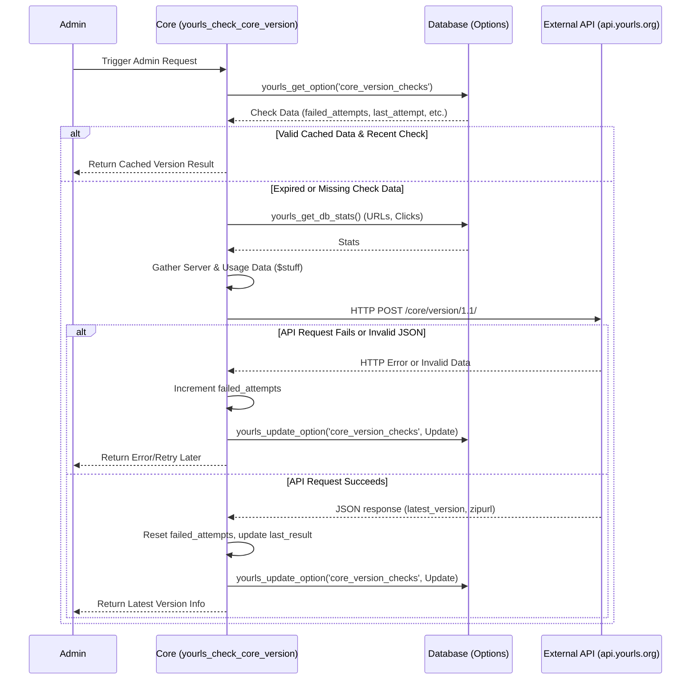
```mermaid
sequenceDiagram
    participant Admin
    participant Core as Core (yourls_check_core_version)
    participant DB as Database (Options)
    participant API as External API (api.yourls.org)

    Admin->>Core: Trigger Admin Request
    Core->>DB: yourls_get_option('core_version_checks')
    DB-->>Core: Check Data (failed_attempts, last_attempt, etc.)

    alt Valid Cached Data & Recent Check
        Core-->>Admin: Return Cached Version Result
    else Expired or Missing Check Data
        Core->>DB: yourls_get_db_stats() (URLs, Clicks)
        DB-->>Core: Stats
        Core->>Core: Gather Server & Usage Data ($stuff)
        Core->>API: HTTP POST /core/version/1.1/

        alt API Request Fails or Invalid JSON
            API-->>Core: HTTP Error or Invalid Data
            Core->>Core: Increment failed_attempts
            Core->>DB: yourls_update_option('core_version_checks', Update)
            Core-->>Admin: Return Error/Retry Later
        else API Request Succeeds
            API-->>Core: JSON response (latest_version, zipurl)
            Core->>Core: Reset failed_attempts, update last_result
            Core->>DB: yourls_update_option('core_version_checks', Update)
            Core-->>Admin: Return Latest Version Info
        end
    end
```

## System Installation Pipeline (admin/install.php)

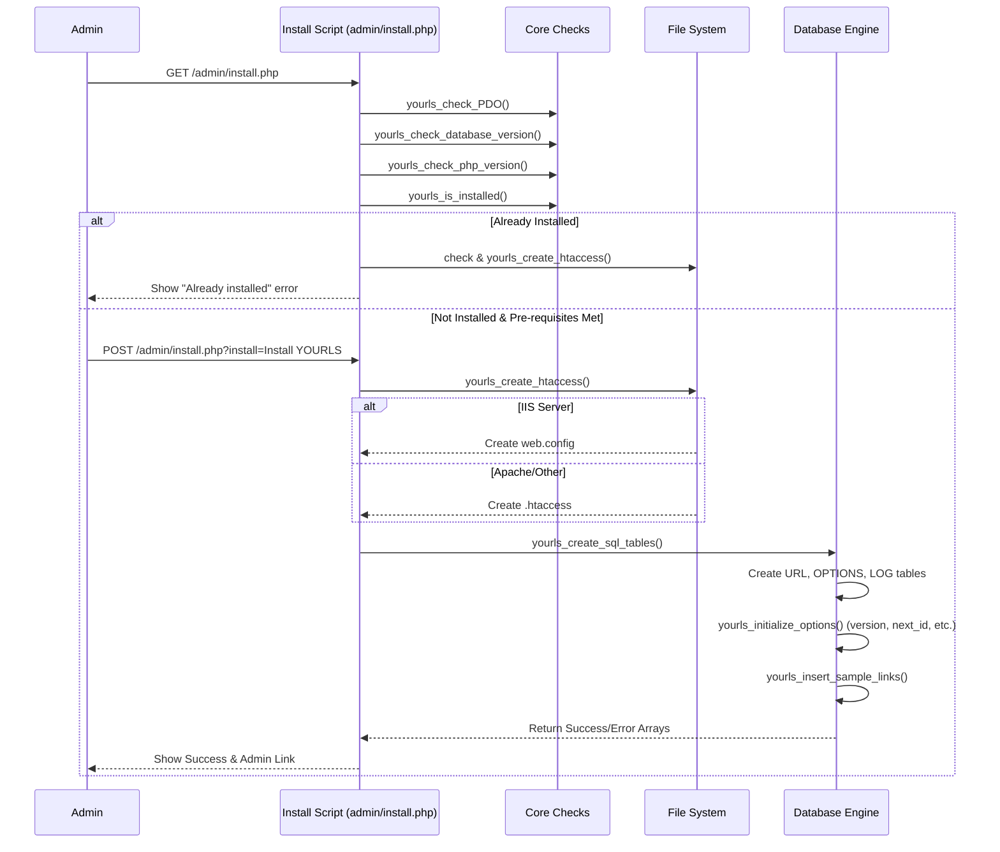
```mermaid
sequenceDiagram
    participant Admin
    participant Install as Install Script (admin/install.php)
    participant Core as Core Checks
    participant FS as File System
    participant DB as Database Engine

    Admin->>Install: GET /admin/install.php
    Install->>Core: yourls_check_PDO()
    Install->>Core: yourls_check_database_version()
    Install->>Core: yourls_check_php_version()
    Install->>Core: yourls_is_installed()
    alt Already Installed
        Install->>FS: check & yourls_create_htaccess()
        Install-->>Admin: Show "Already installed" error
    else Not Installed & Pre-requisites Met
        Admin->>Install: POST /admin/install.php?install=Install YOURLS
        Install->>FS: yourls_create_htaccess()
        alt IIS Server
            FS-->>Install: Create web.config
        else Apache/Other
            FS-->>Install: Create .htaccess
        end
        Install->>DB: yourls_create_sql_tables()
        DB->>DB: Create URL, OPTIONS, LOG tables
        DB->>DB: yourls_initialize_options() (version, next_id, etc.)
        DB->>DB: yourls_insert_sample_links()
        DB-->>Install: Return Success/Error Arrays
        Install-->>Admin: Show Success & Admin Link
    end
```

### MCP Server Integration (KORSAKOV)
The `mcp_server.py` implementation exposes YOURLS API functionalities (`shorturl`, `expand`, `url-stats`) over the Model Context Protocol. Auth credentials are mathematically extracted from the environment (`YOURLS_SIGNATURE`, `YOURLS_USERNAME`, etc) fulfilling CABP isolation invariants—Zero-Trust boundary maintained.
- **Topological DAG**: Documented in `mcp_topology_analysis.md`.
- **Fault Taxonomy**: Handlers implement SERF-compliant error returns protecting against JSON-RPC 2.0 hallucination leakage.
- **Martensite State**: CFDI verified < 0.15 across all tools (`martensite_check.json`).

## Click Tracking & Stats Logging Pipeline (yourls_log_redirect)

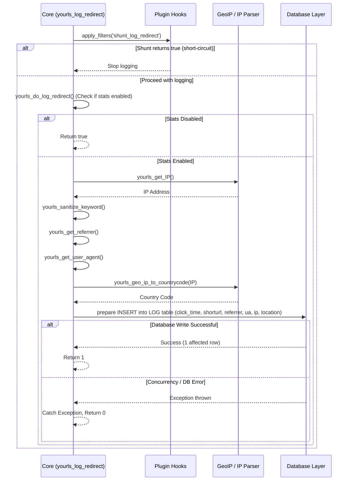
```mermaid
sequenceDiagram
    participant Core as Core (yourls_log_redirect)
    participant Hooks as Plugin Hooks
    participant IP as GeoIP / IP Parser
    participant DB as Database Layer

    Core->>Hooks: apply_filters('shunt_log_redirect')
    alt Shunt returns true (short-circuit)
        Hooks-->>Core: Stop logging
    else Proceed with logging
        Core->>Core: yourls_do_log_redirect() (Check if stats enabled)
        alt Stats Disabled
            Core-->>Core: Return true
        else Stats Enabled
            Core->>IP: yourls_get_IP()
            IP-->>Core: IP Address
            Core->>Core: yourls_sanitize_keyword()
            Core->>Core: yourls_get_referrer()
            Core->>Core: yourls_get_user_agent()
            Core->>IP: yourls_geo_ip_to_countrycode(IP)
            IP-->>Core: Country Code

            Core->>DB: prepare INSERT into LOG table (click_time, shorturl, referrer, ua, ip, location)
            alt Database Write Successful
                DB-->>Core: Success (1 affected row)
                Core-->>Core: Return 1
            else Concurrency / DB Error
                DB-->>Core: Exception thrown
                Core-->>Core: Catch Exception, Return 0
            end
        end
    end
```

## Plugin Hook Resolution Flow (yourls_do_action / yourls_apply_filter)

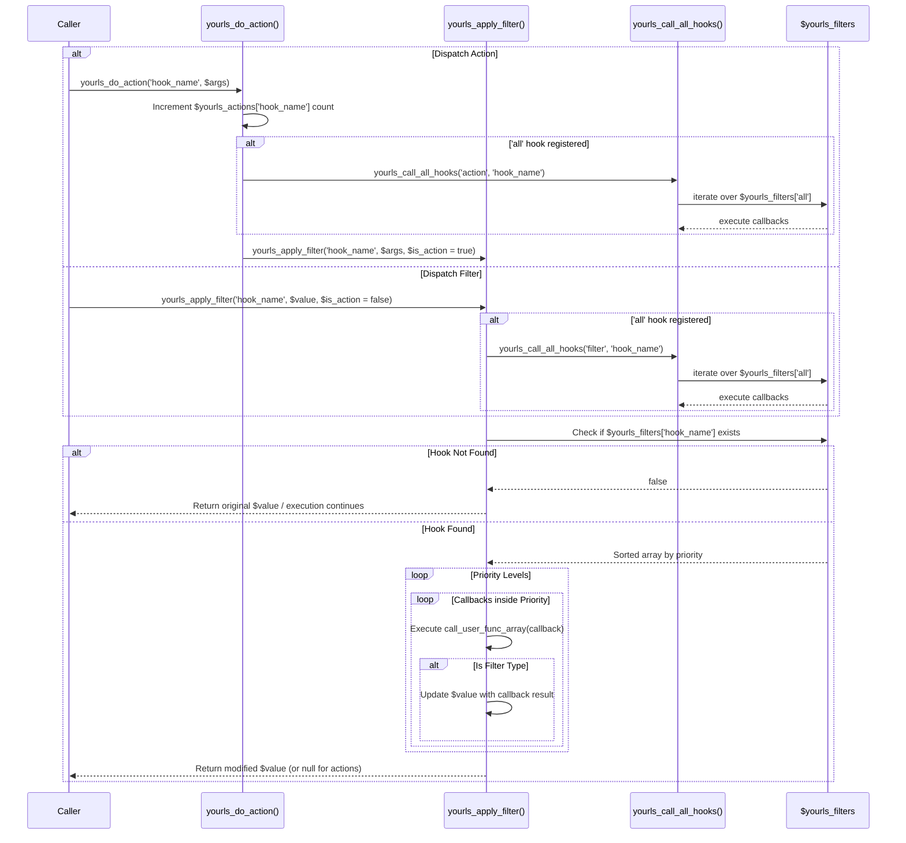
```mermaid
sequenceDiagram
    participant Caller
    participant DoAction as yourls_do_action()
    participant ApplyFilter as yourls_apply_filter()
    participant AllHooks as yourls_call_all_hooks()
    participant Registry as $yourls_filters

    alt Dispatch Action
        Caller->>DoAction: yourls_do_action('hook_name', $args)
        DoAction->>DoAction: Increment $yourls_actions['hook_name'] count

        alt 'all' hook registered
            DoAction->>AllHooks: yourls_call_all_hooks('action', 'hook_name')
            AllHooks->>Registry: iterate over $yourls_filters['all']
            Registry-->>AllHooks: execute callbacks
        end
        DoAction->>ApplyFilter: yourls_apply_filter('hook_name', $args, $is_action = true)
    else Dispatch Filter
        Caller->>ApplyFilter: yourls_apply_filter('hook_name', $value, $is_action = false)
        alt 'all' hook registered
            ApplyFilter->>AllHooks: yourls_call_all_hooks('filter', 'hook_name')
            AllHooks->>Registry: iterate over $yourls_filters['all']
            Registry-->>AllHooks: execute callbacks
        end
    end

    ApplyFilter->>Registry: Check if $yourls_filters['hook_name'] exists
    alt Hook Not Found
        Registry-->>ApplyFilter: false
        ApplyFilter-->>Caller: Return original $value / execution continues
    else Hook Found
        Registry-->>ApplyFilter: Sorted array by priority
        loop Priority Levels
            loop Callbacks inside Priority
                ApplyFilter->>ApplyFilter: Execute call_user_func_array(callback)
                alt Is Filter Type
                    ApplyFilter->>ApplyFilter: Update $value with callback result
                end
            end
        end
        ApplyFilter-->>Caller: Return modified $value (or null for actions)
    end
```

## Database Schema (Relational Topology)

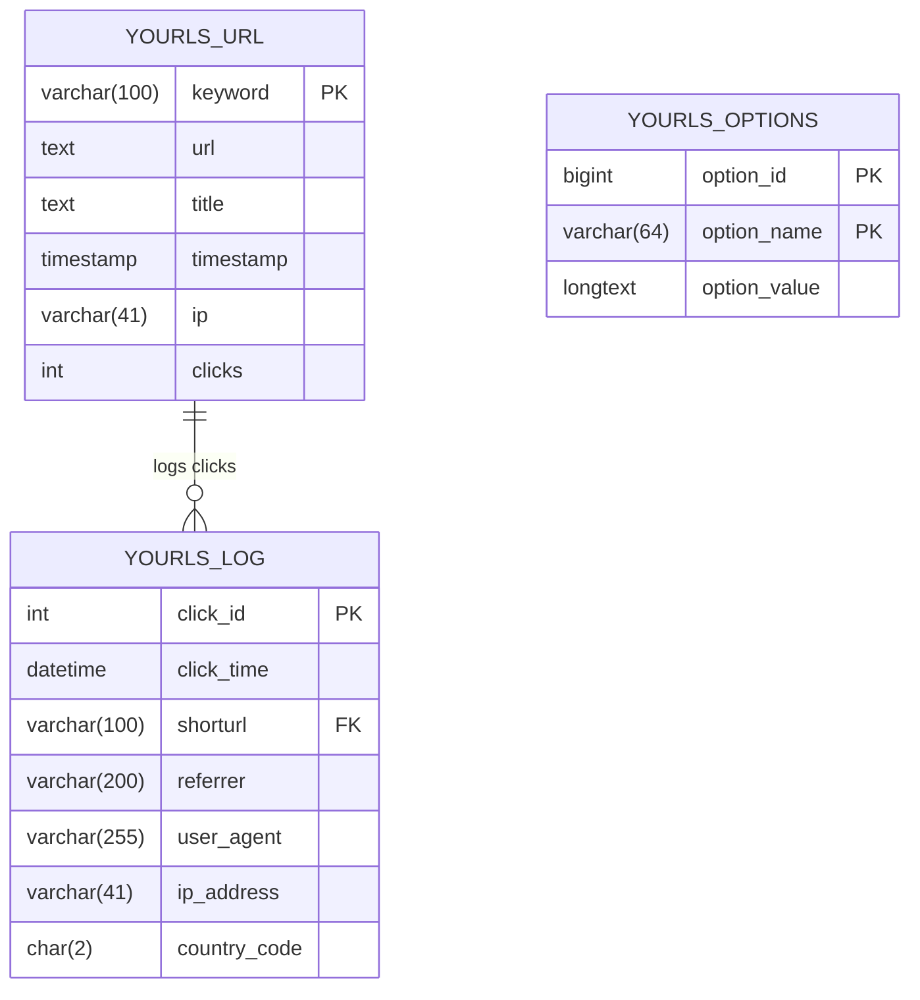
```mermaid
erDiagram
    YOURLS_URL ||--o{ YOURLS_LOG : "logs clicks"
    YOURLS_URL {
        varchar(100) keyword PK
        text url
        text title
        timestamp timestamp
        varchar(41) ip
        int clicks
    }
    YOURLS_LOG {
        int click_id PK
        datetime click_time
        varchar(100) shorturl FK
        varchar(200) referrer
        varchar(255) user_agent
        varchar(41) ip_address
        char(2) country_code
    }
    YOURLS_OPTIONS {
        bigint option_id PK
        varchar(64) option_name PK
        longtext option_value
    }
```

## Structural References
* **ADR**: See [docs/adr/001-mcp-server-architecture.md](docs/adr/001-mcp-server-architecture.md) for the MCP API-led integration decision record.
* **C4 Model Blueprint**: See [docs/c4-model-blueprint.json](docs/c4-model-blueprint.json) for the formal System Context and Container mappings.
* **DDD Context Map**: See [docs/ddd-context-map.yaml](docs/ddd-context-map.yaml) for bounded contexts and upstream/downstream contracts.

## Retention Architect (KUT) Blueprint Integration
The Sovereign Agent Blueprint (KUT) is documented to manage media thermodynamics protocols. See [docs/kut_blueprint.md](docs/kut_blueprint.md) for full operational constraints, schemas, and metrics.
