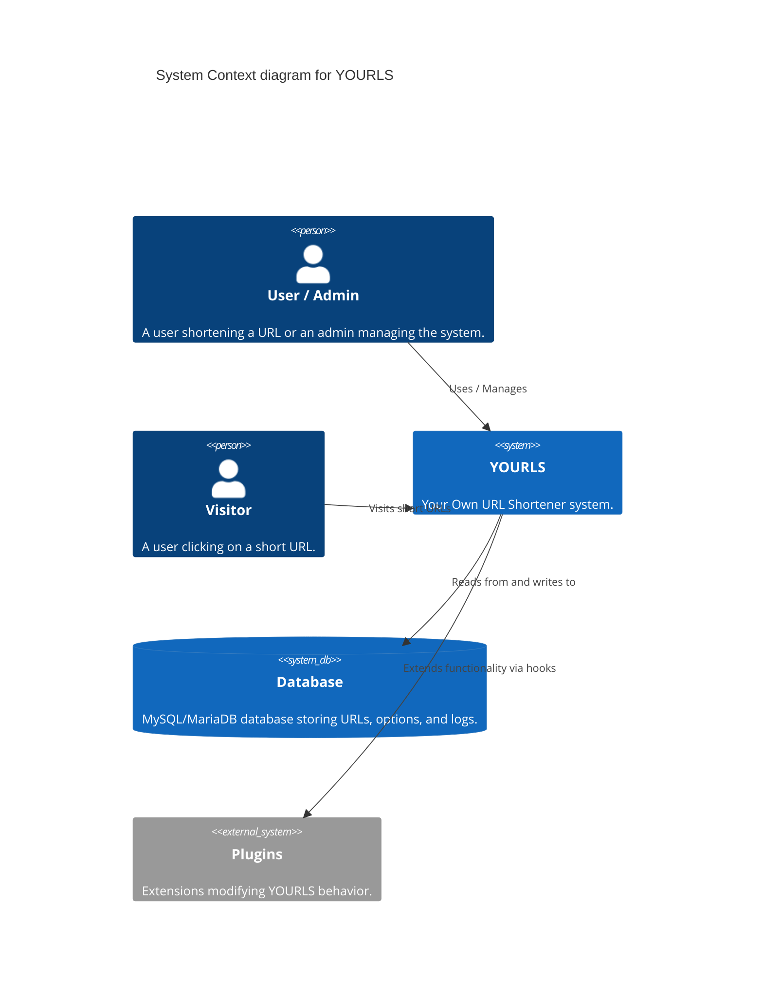
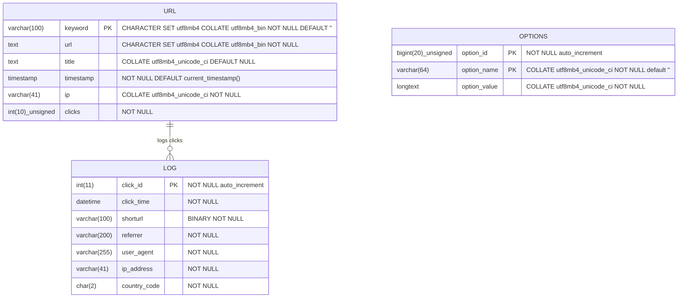
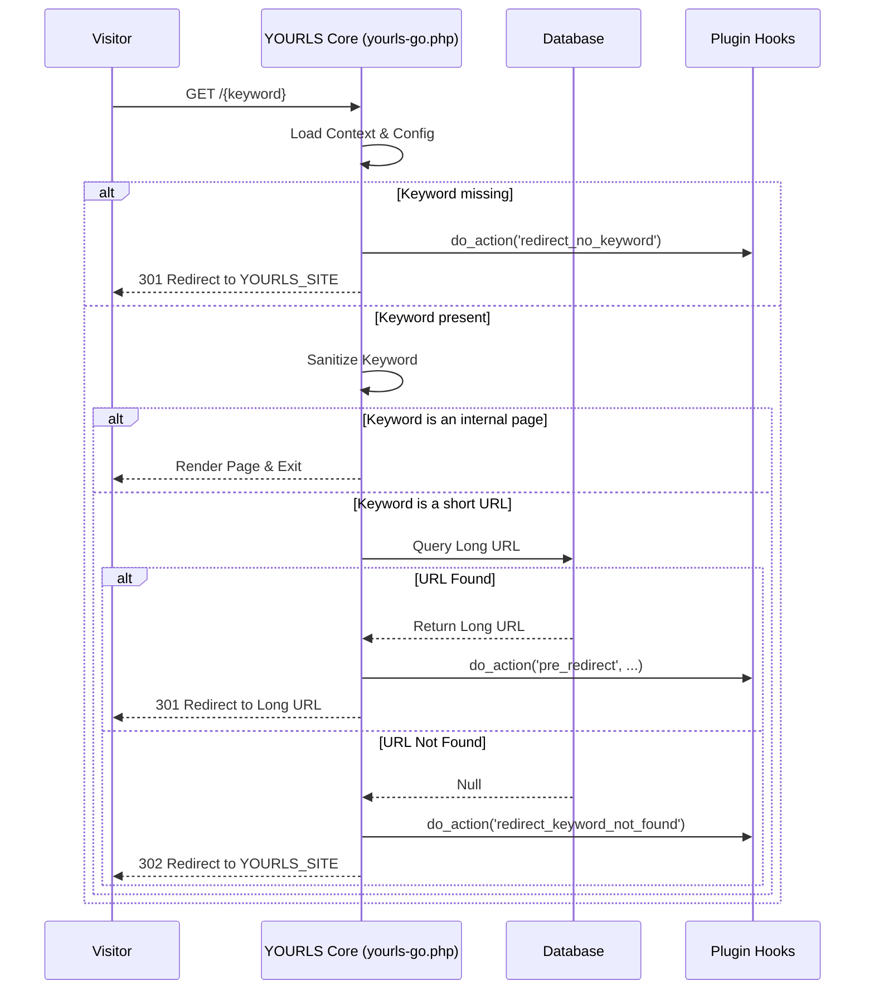
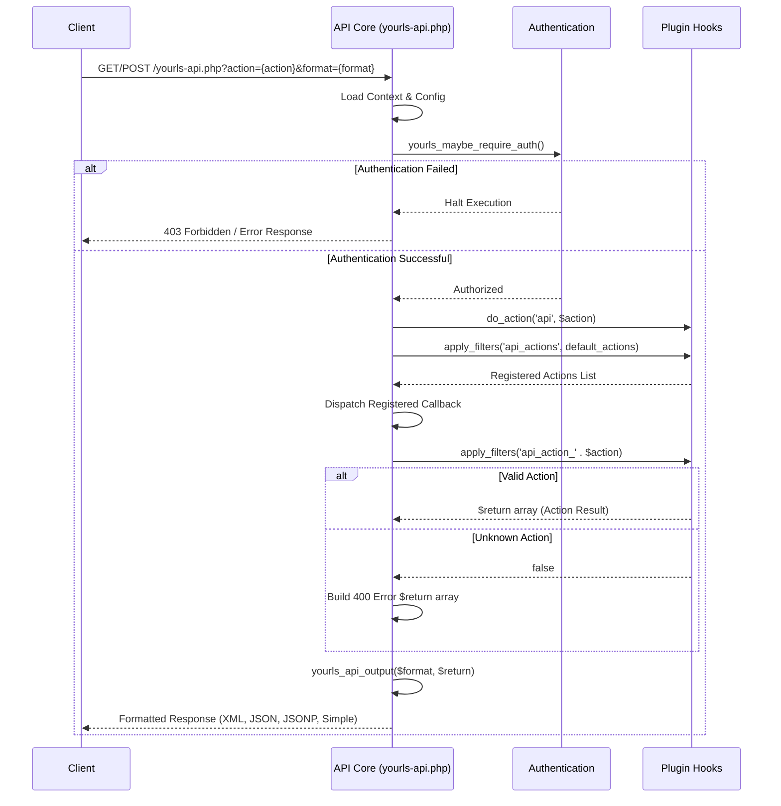
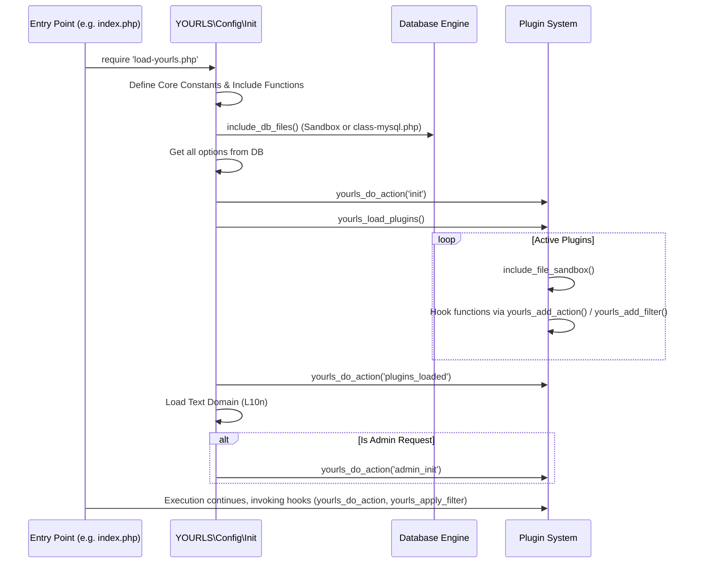
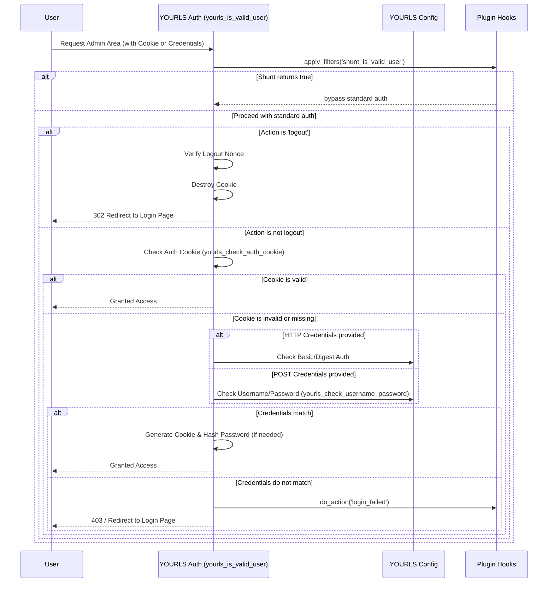
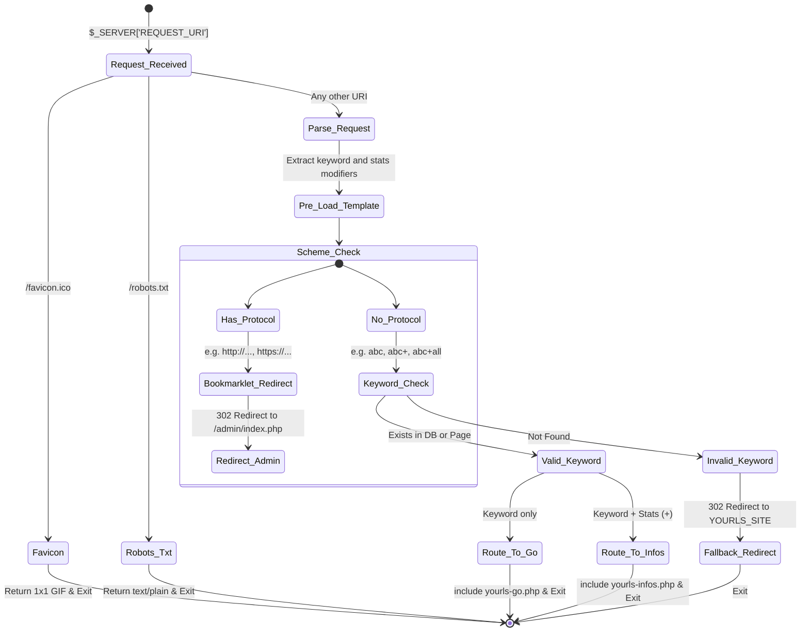
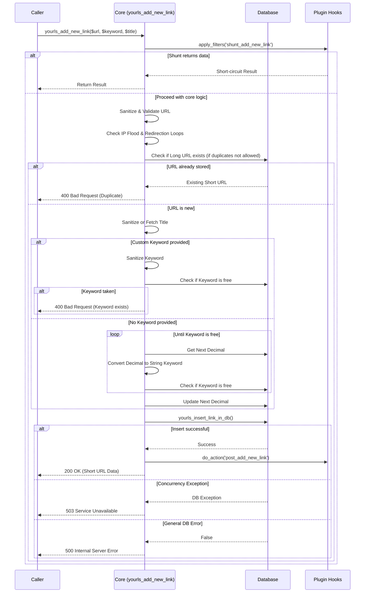
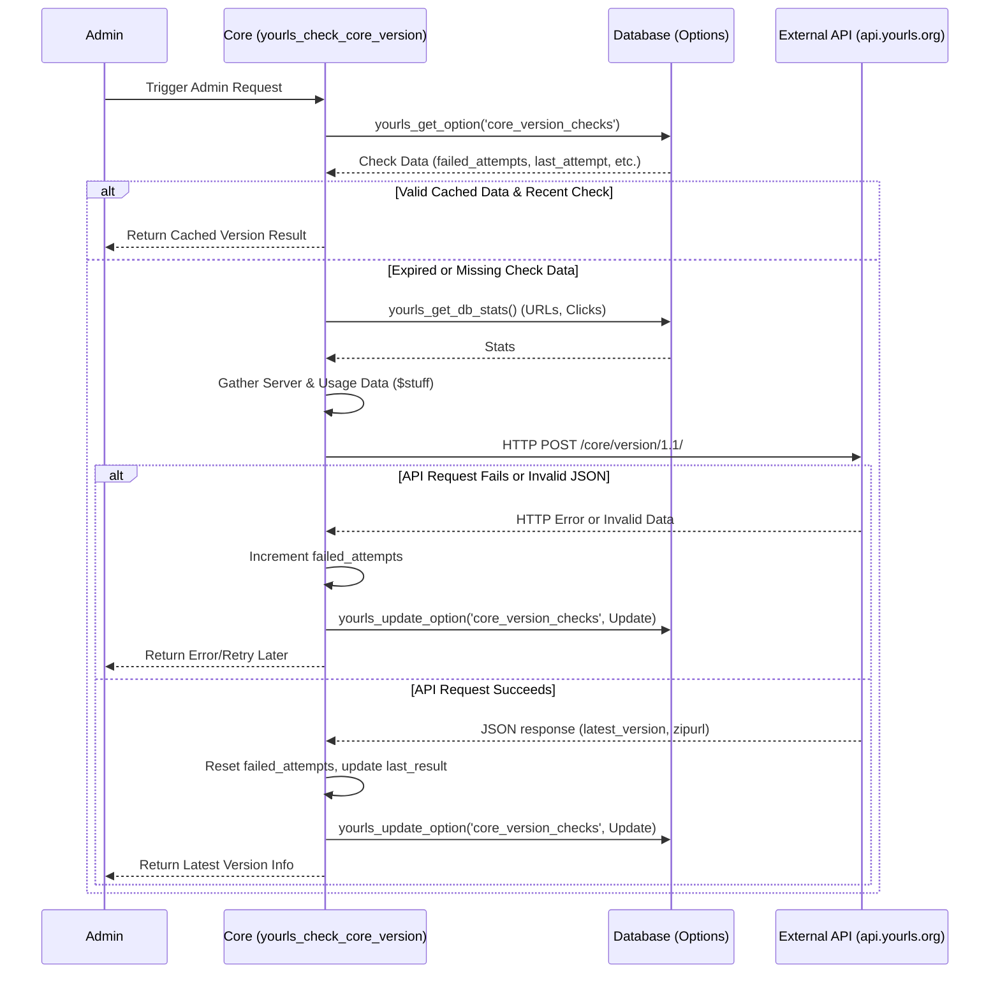
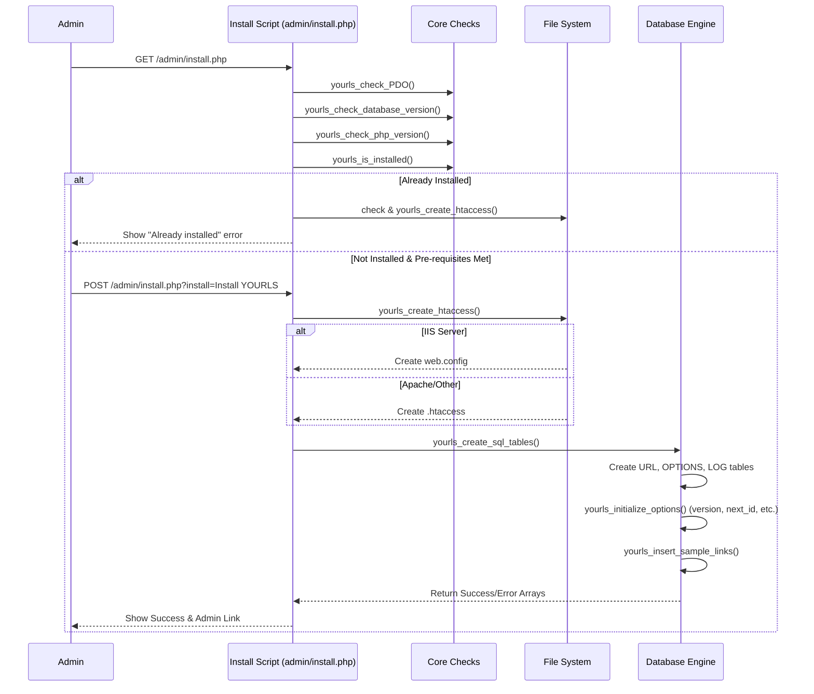

# YOURLS Architecture Map

This document visualizes the hidden boundaries, data flows, and architectural boundaries of the YOURLS project using Mermaid.js diagrams.

## System Context (C4 Model)

## Relational Schema Topography (ER Diagram)

## Short URL Redirection Pipeline (yourls-go.php)

## API Request Pipeline (yourls-api.php)

## Core Initialization & Plugin Hook Architecture

## Authentication Lifecycle (functions-auth.php)

## Loader Routing State Machine (yourls-loader.php)

## URL Shortening Core Flow (yourls_add_new_link)

## Core Version Check Pipeline (yourls_check_core_version)

## System Installation Pipeline (admin/install.php)

