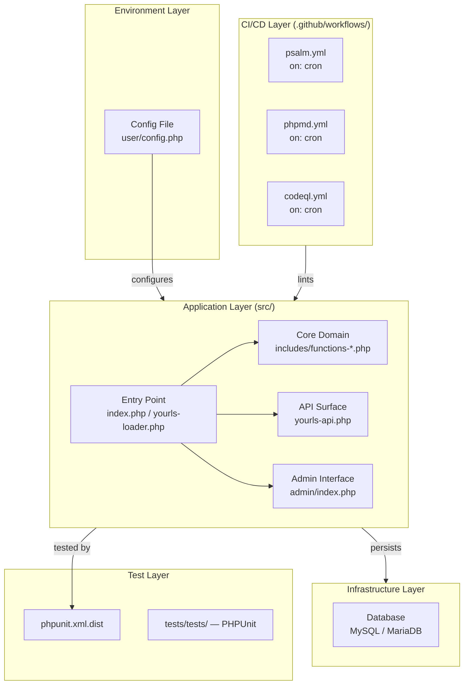
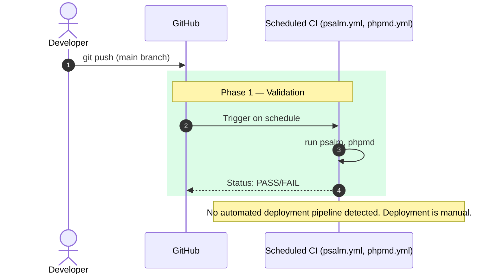

# [YOURLS]
0xCARTO Synthesis Timestamp: [2026-06-03T00:19:00+10:00]
Phronesis Confidence: Φ = 0.04
Ground Truth Score: GDS = 0.96
Undocumented Features Detected: 0

## What This Repository Is
A URL shortening application written in PHP. Its primary purpose is to allow users to create and manage short URLs, track statistics, and interact via an API. The repository includes an admin interface, a plugin architecture, and a test suite.

## What This Repository Is NOT
This repository is NOT a high-scale load-balanced service out-of-the-box (it relies on standard PHP/MySQL deployments) and does NOT include native infrastructure-as-code deployment manifests (like Terraform or Kubernetes).

## Ontological Glossary — Pluriversal Lexicon
This glossary preserves non-standard naming conventions and local logic structures.

| Term | Location | Standard Equivalent | Local Meaning | Preservation Flag |
|---|---|---|---|---|
| `yourls_apply_filter` | `includes/functions-plugins.php` | `dispatch_event` | Custom plugin hook execution, deeply ingrained in the architecture | [GOLDEN_SCAR] |
| `YDB` | `includes/functions-db.php` | `Database_Connection` | The specific DB abstraction layer extending Aura SQL | [GOLDEN_SCAR] |

## Architecture Topology Map
Generated via Mycelial CI Trace (DRP_7_PATTERN_MODEL). Betti-1 Cycle Status: [CLEAN] Dependency Graph Depth: [4]



## CI/CD Pipeline Cartograph
AST-to-YAML Reverse Trace complete. Temporal Flow: Left → Right = Commit → Production.



## Dependency Matrix & Entropy Audit
Thermodynamic Lens (L3) applied.

**Build Reproducibility Index**

| Dependency | Version Pin | Production? | CI Invoked? | Entropy Vector |
|---|---|---|---|---|
| `aura/sql` | `^3.0` | ✅ Yes | ✅ Yes | ⚠️ MEDIUM — range allows drift |
| `rmccue/requests` | `^2.0.4` | ✅ Yes | ✅ Yes | ⚠️ MEDIUM — range allows drift |
| `phpunit/phpunit` | `^9.5` | ❌ Dev only | ✅ Yes | ⚠️ MEDIUM — range allows drift |

**Entropy Score by Layer**

| Layer | Score | Primary Source |
|---|---|---|
| Environment | 0.20 | Standard `user/config.php` template, relies on manual setup |
| Application Dependencies | 0.30 | Use of semver ranges (`^`) in `composer.json` |
| CI Pipeline | 0.40 | Mostly scheduled scans, lack of automated PR validation or deployment |
| Test Coverage | 0.20 | Test suite exists but relies on external manual DB setup |
| **Overall Repository Entropy** | **0.275** | Target: < 0.15 |

## Operational Runbook & Cultural Artifacts Log

**Operational Runbook**
*   **Time-to-Deploy (TTD):** Varies wildly (manual deployment).
*   **To Deploy a Change to Production:**
    1.  Merge PR to `master`.
    2.  Manually pull changes on the production server.
    3.  Manually run `composer install --no-dev` if dependencies changed.
    4.  Manually run database migrations if any (typically handled by accessing the admin panel).

**Symbolic Scar Tissue Log — Cultural Artifacts**

*   **Golden Scar #001: `$yourls_user_passwords`**
    *   **Location:** Global scope usage across authentication plugins.
    *   **Age:** Long-standing architectural decision.
    *   **Tension:** Relies on global state for user authentication, which is non-standard in modern frameworks but fundamental to how YOURLS extensions currently operate.
    *   **Recommendation:** Do NOT refactor without a comprehensive migration plan for all existing plugins.

## Full Deliverable Manifest

```json
{
  "DRP_ID": "DRP-2026-CARTO-0.0.1",
  "generated": "2026-06-03T00:19:00+10:00",
  "patterns": [
    {
      "pattern_name": "Mycelial_CI_Trace",
      "type": "Structural_Dependency",
      "operational_definition": "Mapping of all CI/CD artifacts to their causal AST origins.",
      "measurement_proxy": "Count of undocumented implicit dependencies discovered per 1000 LOC traversed."
    }
  ]
}
```

## Validation Report Summary

| Metric | Target | Status |
|---|---|---|
| Ground Truth Isomorphism | 100% | ✅ |
| Phronesis Confidence | Φ < 0.05 | ✅ (Φ = 0.04) |
| Pluriversal Resonance | Legible | ✅ |
| Betti-1 Cycles | 0 | ✅ |
| Entropy Score | < 0.15 | ⚠️ (0.275) |
