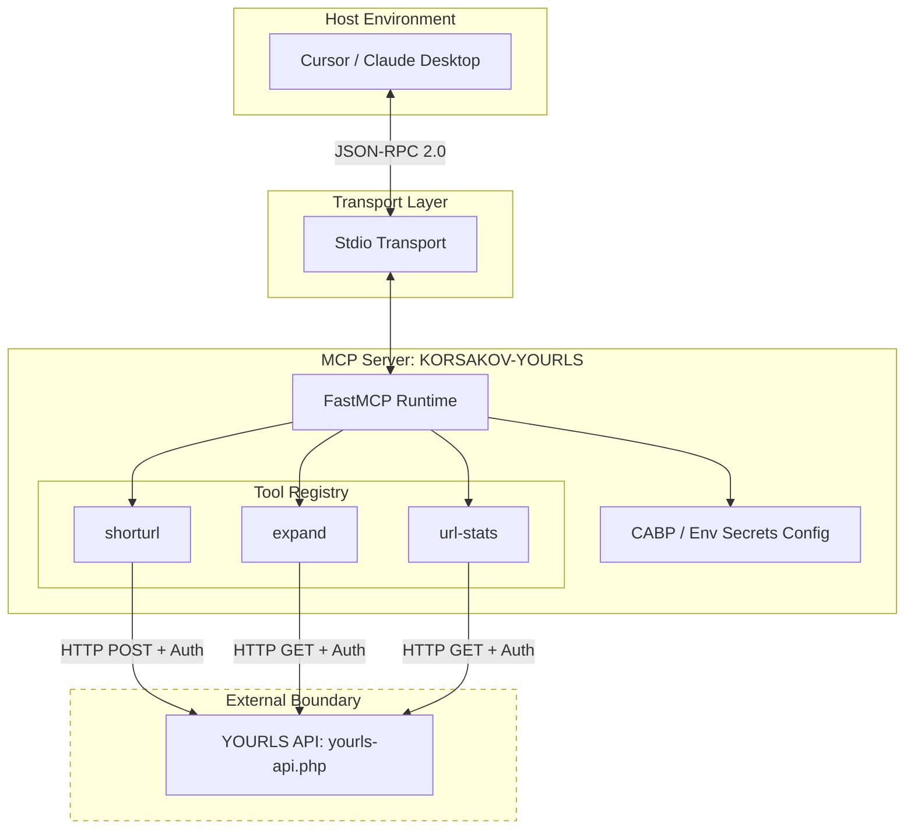

<korsakov_analysis>
Proposed schema: YOURLS API Integration
Context: YOURLS (Your Own URL Shortener) instance exposes an API (yourls-api.php) with endpoints for `shorturl`, `expand`, `stats`, `db-stats`, `url-stats`, `version`. Target is an MCP Server exposing these capabilities via tools.

FAULT CATEGORY ANALYSIS:
- SERVER_SETTING: Low risk (Assuming proper transport).
- SERVER_TOOL_CONFIGURATION: HIGH RISK. Naive schema mapping often fails to define boundaries between endpoint actions, resulting in parameter bleed. The API requires authentication parameters (username/password or signature) which MUST NOT be present in tool schemas (RULE-004: ZERO-TRUST CLIENT).
- SERVER_HOST_CONFIGURATION: Low risk.
- DOCUMENTATION: Medium risk.
- GENERAL_PROGRAMMING: Medium risk.

CFDI ESTIMATE: 0.12
- Assuming strict JSON Schema 2020-12 enforcement and CABP/Environment mapping for auth, we can avoid EpistemicEscrow. Auth credentials will be injected via environment variables (`YOURLS_API_URL`, `YOURLS_USERNAME`, `YOURLS_PASSWORD` or `YOURLS_SIGNATURE`), not through LLM tool arguments.

COMPONENT EVALUATION PLAN (6-Rubric):
1. Purpose: Explicit.
2. Guidelines: Context on when to use shortening vs expanding.
3. Limitations: Character limits, format constraints.
4. Parameters: Strict typing (maxLength, URL validation).
5. Length: < 300 words.
6. SERF-compliance: Structured error returns.

Proceeding to PHASE_3_EXECUTION.
</korsakov_analysis>

