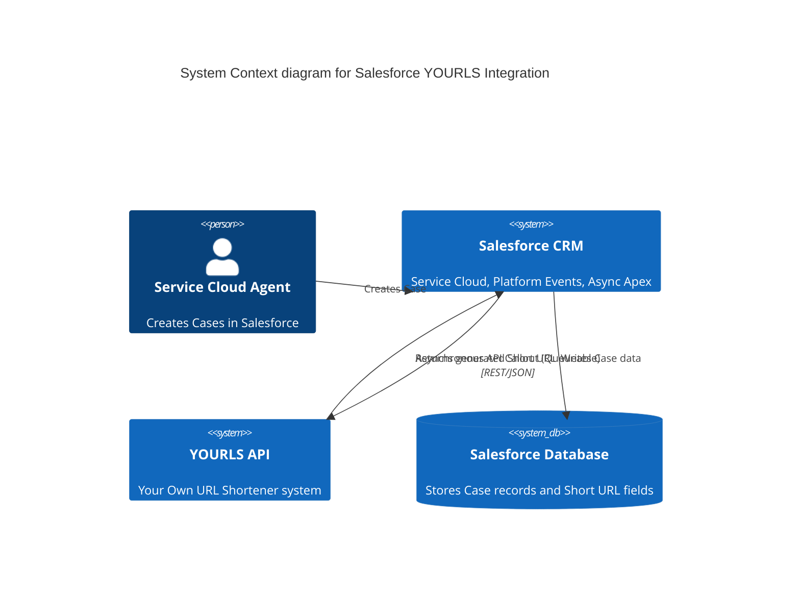
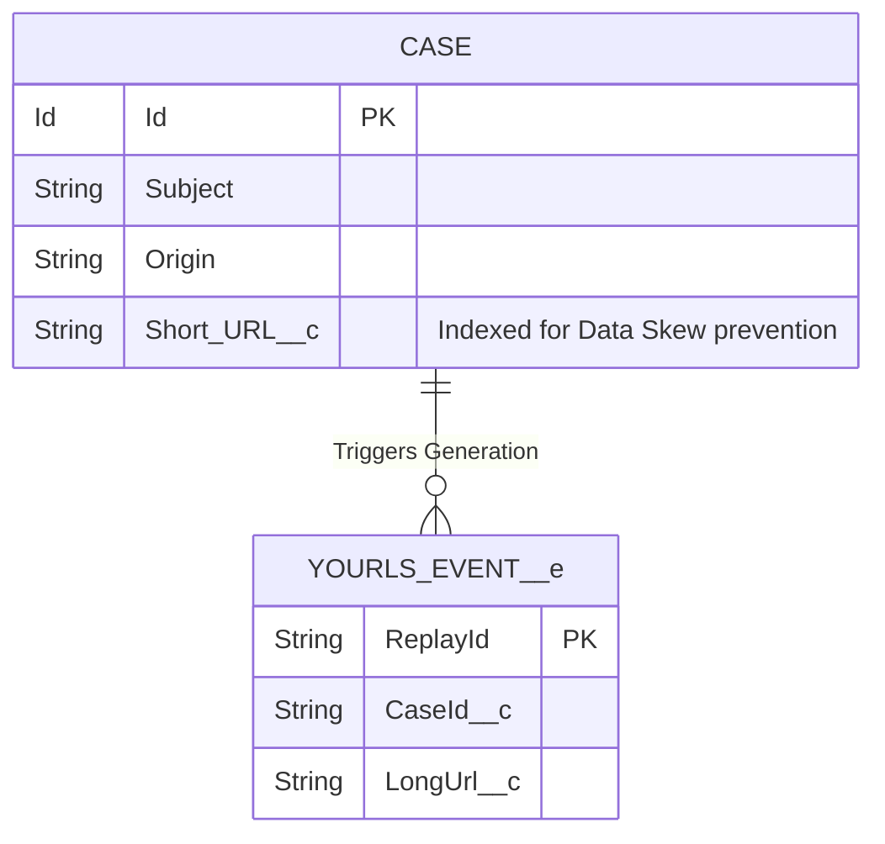

# Salesforce to YOURLS Integration Architecture

## System Context (C4 Model)

```mermaid
C4Context
  title System Context diagram for Salesforce YOURLS Integration
  Person(agent, "Service Cloud Agent", "Creates Cases in Salesforce")
  System(salesforce, "Salesforce CRM", "Service Cloud, Platform Events, Async Apex")
  System(yourls, "YOURLS API", "Your Own URL Shortener system")
  SystemDb(sf_db, "Salesforce Database", "Stores Case records and Short URL fields")

  Rel(agent, salesforce, "Creates Case")
  Rel(salesforce, sf_db, "Writes Case data")
  Rel(salesforce, yourls, "Asynchronous API Callout (Queueable)", "REST/JSON")
  Rel(yourls, salesforce, "Returns generated Short URL")
```

## Relational Schema & Event Flow (ER Diagram)

```mermaid
erDiagram
    CASE {
        Id Id PK
        String Subject
        String Origin
        String Short_URL__c "Indexed for Data Skew prevention"
    }
    YOURLS_EVENT__e {
        String ReplayId PK
        String CaseId__c
        String LongUrl__c
    }

    CASE ||--o{ YOURLS_EVENT__e : "Triggers Generation"
    %% +++SDRTSegment: Asynchronous decoupling boundary ensuring limits are preserved
```
